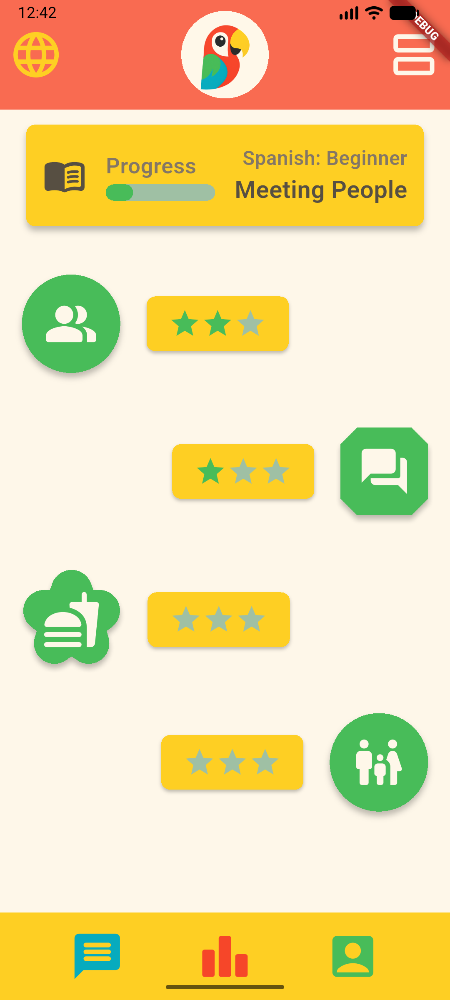
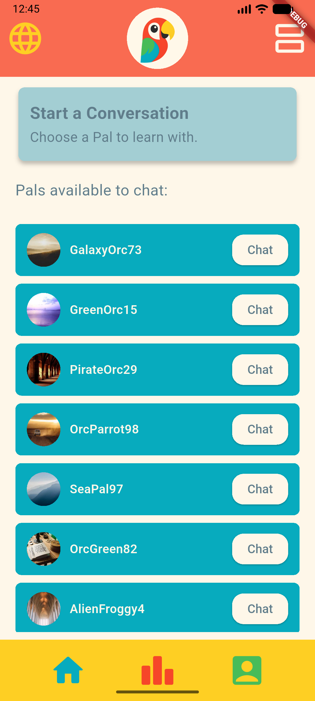
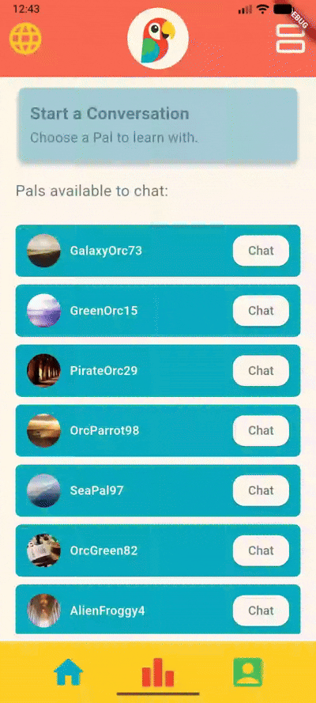
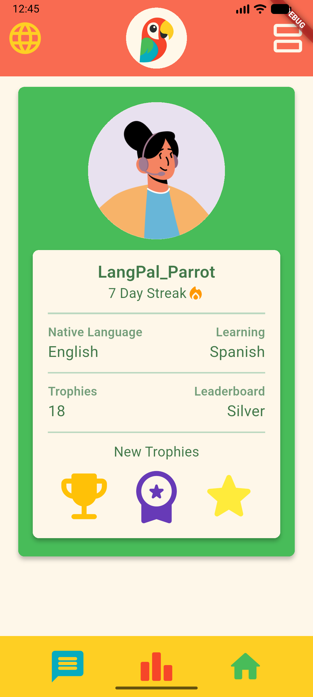
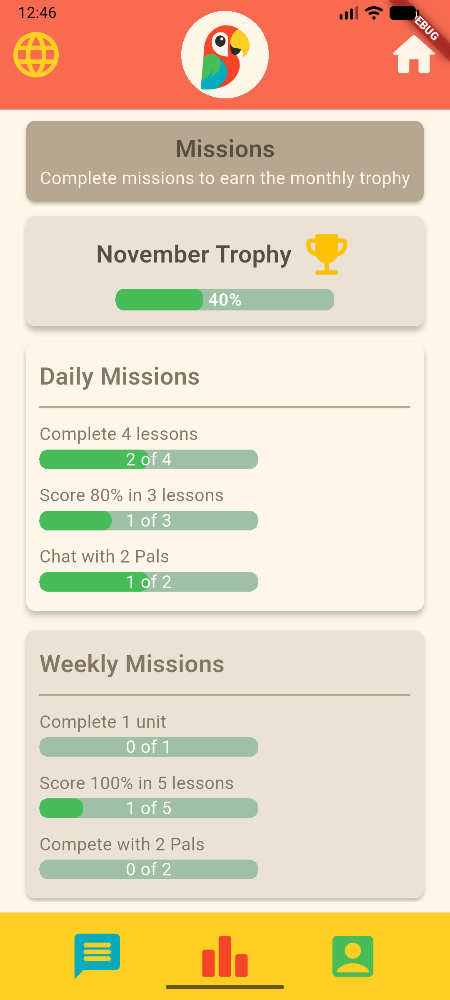

LangPal Prototype - Mobile app using Flutter in VSCode

1) Main Screen Page

   Includes:
   - A card at the top of the screen that includes the user's progress and the level of learning their selected language.
   - A scrollable page of the chapters in the unit, each showing how many stars they completed the chapter with.

2) Start Conversation Page

   Includes:
   - A card at the top of the screen that tells the user to choose a Pal from the list.
   - A list of the available Pals that the user can start a conversation with.

4) User Profile Page

   Includes:
   - An icon of the user's profile picture.
   - A card that includes:
     - Username and the user's streak
     - The user's native language and the language they are learning
     - The number of trophies the user has gained
     - The user's placement on the leaderboard
     - Recent new trophies the user has earned

5) Missions Page

   Includes:
   - A card at the top of the screen that tells the user to complete missions to earn trophies
   - A card that shows the current month's trophy and the user's progress towards earning that trophy
   - A card that shows the Daily Missions, what missions the user can complete, and their progress
   - A card that shows the Weekly Missions, what missions the user can complete, and their progress

**Each page has top and bottom navigation bars.
